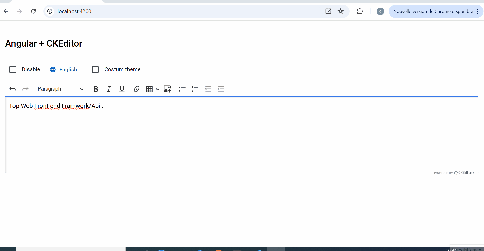

# AngularCKEditor

This project demonstrates how to integrate CKEditor (open-source version) into an Angular application. It explores advanced features such as custom theming, editor enabling/disabling, and localization with support for English and Arabic.



## 🛠️ Technologies Used
- **Angular** (^19.0.1): Frontend framework.
- **CKEditor 5:** Rich text editor library.
- **Angular Material** (^19.0.1): UI components for a modern and responsive design.
- **Tailwind:** Open source css framework.

## 📦 Installation

### Prerequisites
Ensure you have the following installed:
- **Node.js**  ^18.19.1 
- **Angular CLI** ^19.0.1

### Steps
1. Clone the repository:
   ```bash
   git clone https://github.com/omdaCh/angular-CKEditor.git
   cd angular-CKEditor

2. Install dependencies:
   ```bash
   npm install

3. Run the application:
   Run `ng serve` for a dev server. Navigate to `http://localhost:4200/`. The application will automatically reload if you change any of the source files.

## ℹ️ More Information
For a detailed explanation and step-by-step guide, you can read the full article on Medium https://medium.com/@chemakhi.imad/ckeditor-in-angular-a-seamless-integration-f241318c4da4.

## 🤝 Contributions
Contributions are welcome! Feel free to submit a pull request or open an issue to suggest improvements.

## 📄 License
This project is licensed under the MIT License. See the LICENSE file for details.

## 📧 Contact
For questions or suggestions, reach out to chemakhi.imad@gmail.com or connect with me on LinkedIn https://www.linkedin.com/in/imad-chemakhi-371a45218.